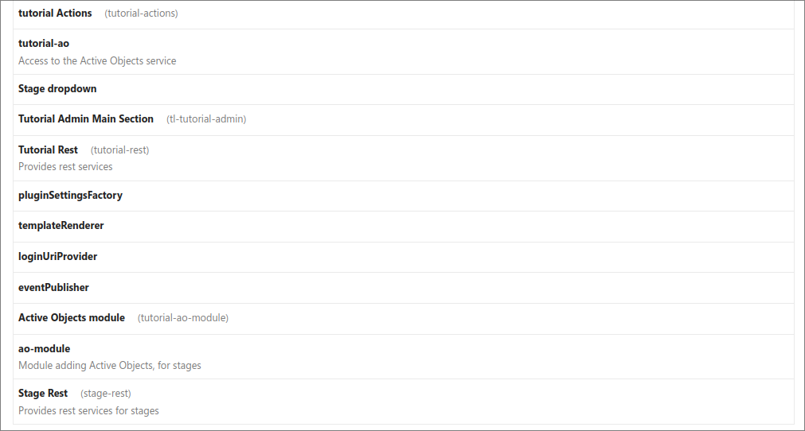
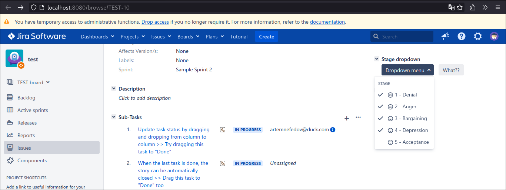
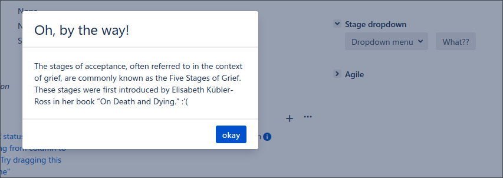
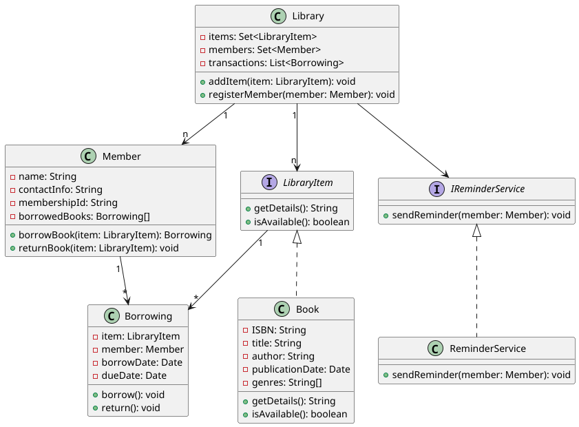

# teamlead-test

---
## 1. plug-in update for Jira
> I'll add the assembled plugin `jira-plugin-tutorial-1.0.0.jar` to the `jira-plugin-tutorial_jira9` folder
> 
> 

>### dropdown that takes data from Active Objects
>

>### AUI-Dialog2
>

## 2. Class Diagram
### 2.1.  UML class diagram

### 2.2.  Follows SOLID principles
#### SOLID principles
> - **Single Responsibility Principle**
> 
> In my design, each class is responsible for one specific task. This approach helps to reduce relatedness.

> - **Open/Closed Principle**
> 
> The system is built to be extensible without modifying existing code. A key example is the `LibraryItem` interface, which makes it easy to add new media types, such as DVDs or magazines, without modifying classes already existing in the system. This approach protects the code from having to make changes to the base classes when adding new functionality.

> - **Liskov Substitution Principle**
> 
> The LSP principle is respected through the use of interfaces. The `Book` class implements the `LibraryItem` interface, which allows books to be replaced by other media types (e.g. DVDs) without breaking the system. Any new class that implements `LibraryItem` can be used in code that works with books.

> - **Interface Segregation Principle**
> 
> The ISP principle is observed through the use of specialized interfaces. For example, `IReminderService` is designed to manage sending reminders, which allows other classes not to depend on its implementation and focus on their own tasks. This makes the system more flexible and allows to implement different reminder services without changing the basic logic.

> - **Dependency Inversion Principle**
> 
> In design, I use dependencies on abstractions rather than on specific classes. For example, the `Library` class depends on the `IReminderService` interface rather than on a specific implementation of `ReminderService`. This makes it easy to change the implementation of sending reminders without affecting the code of other classes, which improves the scalability and maintainability of the system.

